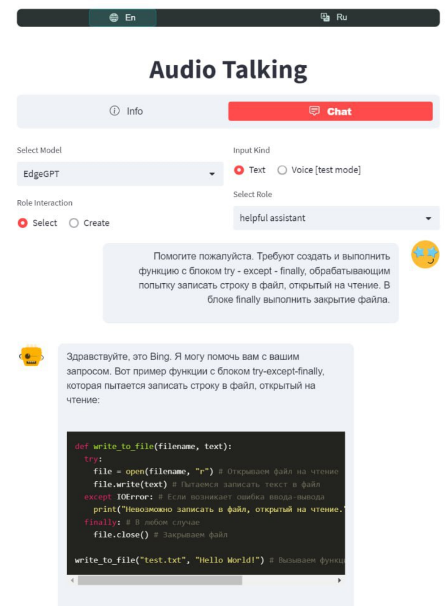

# AudioChatGPT

Welcome to our new chat interface! This AI-powered system allows you to not only type your messages but also speak to the AI and receive voice responses. Here are some of the chat possibilities you can explore:

- **Text-based messaging**: Type your message in the chat box and hit send. The AI will respond with text-based messages.
- **Voice-based messaging**: Click on the microphone icon to activate voice messaging. Speak your message and the AI will respond with a voice message.
- **Multi-modal messaging**: Switch between text-based and voice-based messaging modes depending on your preference. For example, you can type your message and then switch to voice mode to hear the AI's response. (_not implemented_)
- **Language translation**: If you're chatting with someone who speaks a different language, the AI can help translate your messages in real-time. (_not implemented_)
- **Personalized interactions**: As you chat with the AI, it will learn and adapt to your preferences and provide personalized responses based on your history of interactions. (_not implemented_)

We hope you enjoy using our new chat interface and discover new possibilities for communicating with AI.

## Installation and Usage

To install the required dependencies for the AudioChatGPT project:
1. Clone the repo: `git clone https://github.com/Diyago/AudioChatGPT`
2. Install requirements `pip install -r requirements.txt`
3. Run the chat `streamlit run src/chat_ui/streamlit_chatter.py`

 